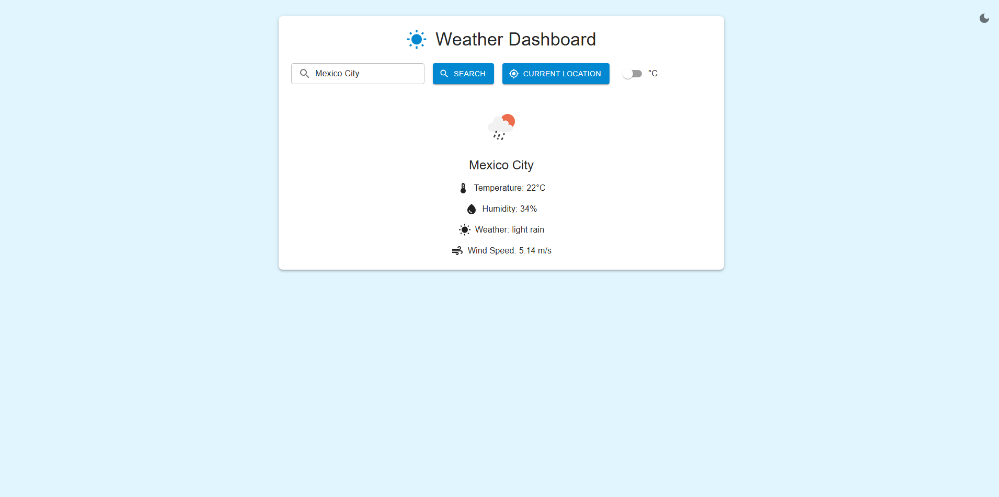

# Weather Dashboard App

A dynamic weather dashboard application built with React and Material-UI that provides real-time weather information with a theme that adapts based on weather conditions.

## Features

- Search weather by city name
- Get weather for current location
- Toggle between Celsius and Fahrenheit
- Dynamic theme that changes based on weather conditions
- Light/Dark mode toggle
- Responsive design
- Persistent theme preferences



 A dynamic weather dashboard application built with React and Material-UI that provides real-time weather information with a theme that adapts based on weather conditions.

## Technologies Used

- React 18
- Material-UI (MUI) v5
- OpenWeatherMap API
- React Testing Library
- Jest

## Getting Started

### Prerequisites

- Node.js (v14 or higher)
- npm or yarn
- OpenWeatherMap API key

### Installation

1. Clone the repository:
   ```bash
   git clone https://github.com/yourusername/weather-dashboard.git
   ```

2. Install dependencies:
   ```bash
   cd weather-dashboard
   npm install
   ```

3. Create a `.env` file in the root directory and add your OpenWeatherMap API key:
   ```
   REACT_APP_WEATHER_API_KEY=your_api_key_here
   ```

4. Start the development server:
   ```bash
   npm start
   ```

## Testing

Run the test suite:

## AI-Assisted Development

This project was developed as an introduction to AI-assisted coding. Key areas where AI provided assistance include:
- Initial project structure
- Component architecture
- Theme implementation
- Testing setup
- Error handling
- Feature suggestions and improvements

## Key Learnings

- Effective use of AI in code development
- Balancing AI suggestions with human oversight
- Maintaining code quality while using AI
- Testing practices in AI-assisted development
- Dynamic theming implementation
- Weather API integration

## Future Improvements

- Weather forecast for multiple days
- More detailed weather information
- Location autocomplete
- Weather alerts
- More weather-based themes
- Mobile app version

## License

ISC

## Acknowledgments

- OpenWeather API for weather data
- Material-UI for components
- Claude (Anthropic) for development assistance